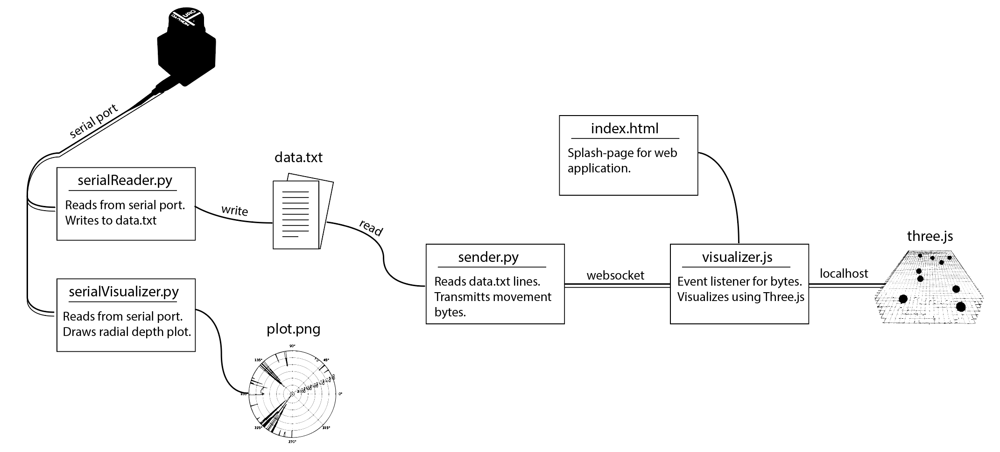

# Population_Flux

Population Flux is a typology machine that measures the different population trends of people in rooms and how people tend to move in and out of rooms (individual/group) in order for viewers to see how busy rooms are at certain times.

## Interface



Layout of the data-transfer operations. Terminals need to be set up to listen from the serial port, transmit data over a web socket, and launch a localhost to view the visualization. The serial port terminal can be run independently to first capture the data, while the other two terminals can be run to parse and visualize the results.

## Setup

In a terminal at the home directory,
```bash
cd /dev/
ls
```
Look for a device named tty.usbmodem(#number). In urg/pyUrg.py, change the port variable default to the name of the tty modem (this will depend on the port your device is connected to).

```python
 def connect(self, port = '/dev/tty.usbmodem(#number)', baudrate = 115200, timeout = 0.1):
```

You can configure the active entrance and exit range for the lidar in urg/serialReader.py.
```python
# of the form [peak, span] in degrees
entranceRange   = [480,40]
entranceFallout = [480,60] # must have greater span than entranceRange
exitRange   = [400,40]
exitFallout = [400,60]     # must have greater span than exitRange
```

## Running

To visualize the incoming Lidar data, run:
```bash
python urg/serialViewer.py 
```

To parse and save the Lidar data, make sure there is an empty data.txt file in websocket/, and run:
```bash
python urg/serialRunner.py 
```

To forward the data to the server, run (and keep alive):
```bash
python3 websocket/sender.py
```

To forward the data to the server, run:
```bash
python3 websocket/sender.py
```

Start a localhost at the root directory in order to visualize the results
```bash
python3 -m http.server
```


